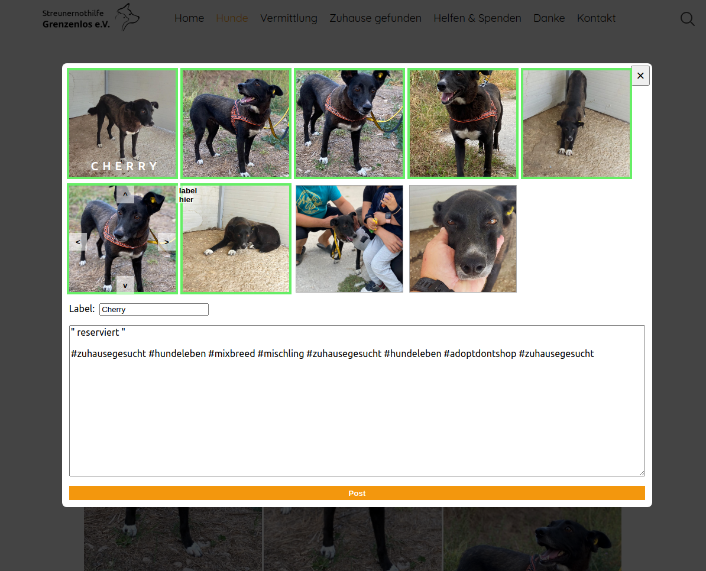

# SNHG Insta Tool

Little tool for quickly posting dogs from [streunernothilfe-grenzenlos.de](https://www.streunernothilfe-grenzenlos.de/) to our [instagram account](https://www.instagram.com/streunernothilfe_grenzenlos/?hl=de), by collecting images and texts from the site using a tampermonkey userscript and a local go-webserver.
Automatically crops images to a square and adds a label on a chosen image.

## Development

**local webserver:**
- install [Go](https://go.dev/)
- `go mod tidy`
- `go run . INSTA_USERNAME INSTA_PASSWORD`

**Tampermonkey userscript:**
- `cd frontend`
- `npm install`
- `npx webpack`
- copy frontend/build/tampermonkeyscript.js to a new [Tampermonkey](https://www.tampermonkey.net/) userscript
- navigate to any dog on [streunernothilfe-grenzenlos.de](https://www.streunernothilfe-grenzenlos.de/) i.e [cherry](https://www.streunernothilfe-grenzenlos.de/hunde/h%C3%BCndinnen/cherry/)
- press ctrl + i
- select images to post
- press **Post** button